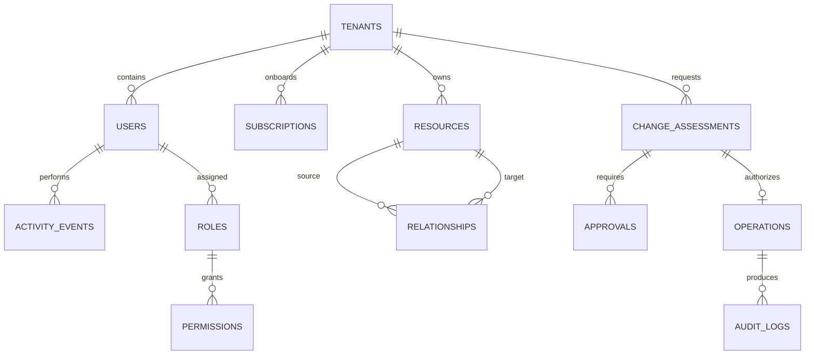

# Data Architecture

## Database Topology

Phase 1 uses one private Azure Database for PostgreSQL Flexible Server with a Sentinel
database and service-owned schemas:

| Schema | Owner | Core tables |
|---|---|---|
| `identity` | Identity service | tenants, users, roles, permissions, memberships |
| `inventory` | Inventory service | subscriptions, resources, sync jobs |
| `relationships` | Relationship service | relationships, graph snapshots |
| `intelligence` | Change Intelligence | change assessments, findings |
| `operations` | Operations service | operations, approvals, execution attempts |
| `audit` | Audit service | audit logs, activity events, export batches |
| `platform` | Platform libraries | outbox/inbox records per service deployment |

Separate PostgreSQL roles own each schema. There are no runtime superuser credentials.
Services do not issue cross-schema queries. Cross-context identifiers are UUID values,
validated at API/event boundaries, not cross-schema foreign keys.

This is a deliberate balance: one managed server reduces Phase 1 cost and backup
complexity while schema and role isolation preserve a path to separate databases.

The MVP implements a shared `platform.outbox` table and relay. Business state and audit
events commit atomically. Local Compose relays audit events over authenticated internal
HTTP; the AKS production transport remains Azure Service Bus as required by ADR 004.

## Tenant Isolation

Every tenant-owned table contains a non-null `tenant_id`. All unique constraints and
high-cardinality indexes begin with `tenant_id` when the access pattern is tenant
scoped.

At transaction start, the data layer executes:

```sql
SET LOCAL app.tenant_id = '<internal-tenant-uuid>';
SET LOCAL app.actor_id = '<internal-user-or-workload-uuid>';
```

Row-level security policies compare `tenant_id` to
`current_setting('app.tenant_id', true)::uuid`. The application role cannot bypass
RLS. Background workers process one tenant per transaction. Platform administration
uses separate audited break-glass roles.

Application filtering remains mandatory; RLS is defense in depth, not a substitute
for correct repository queries.

## Identifier and Time Conventions

- Internal primary keys: UUID v7 when library support is selected, otherwise UUID v4.
- Azure resources: normalized lowercase ARM resource ID plus original display value.
- External tenant: Entra tenant ID (`tid`) stored as UUID. Organizational workspace
  identity is `tenant:<tid>`; personal workspace identity is
  `personal:<consumer-tid>:<oid>`.
- Timestamps: `timestamptz` in UTC.
- Optimistic concurrency: integer `version` or source ETag.
- Soft deletion: only where historical identity is required; operational evidence is
  never physically deleted through product APIs.
- JSONB: only for provider-specific properties, evidence, and immutable snapshots.

## Core Logical Model



The physical schema is specified in
[`database/schema.sql`](../../database/schema.sql). It is a design baseline; each
service will later own an Alembic migration subset.

## Resource Inventory

`resources` stores searchable normalized columns and a bounded JSONB property document.
Large raw ARG responses are written to Blob Storage and referenced by URI and checksum.
Resource upserts use `(tenant_id, normalized_resource_id)` as the natural uniqueness
boundary.

Deletion uses a two-stage model:

1. Resource absent from a successful full scan becomes `missing`.
2. Resource absent across the configured confirmation window becomes `deleted`.

This prevents transient permission or ARG failures from producing false deletion
impact.

## Relationship Semantics

Relationships are directed and typed. The unique identity is tenant, source, target,
type, and source system. An edge contains:

- confidence (`0.0` to `1.0`)
- evidence JSON
- extractor name and version
- first and last observation timestamps
- lifecycle state

Edges may be explicit (ARM property), inferred (matching IDs), authorization-based
(RBAC access), or runtime (Kubernetes reference). Risk rules can require minimum
confidence and distinguish hard dependencies from soft associations.

## Change Assessment Immutability

An assessment has mutable workflow state but immutable assessed input. The canonical
input is serialized deterministically and hashed with SHA-256. Approvals bind to that
hash. Execution rejects:

- a changed action or parameter set
- a different target version/ETag
- an expired inventory snapshot
- an expired approval
- a superseded risk rule set

## Audit Retention

The transactional audit schema supports search and UI access. Audit export writes
newline-delimited JSON batches to a storage account with immutable, time-based
retention and legal hold capability. Each batch includes a hash chain and manifest.

PII is minimized. Access tokens, refresh tokens, secret values, connection strings,
certificate private material, and request authorization headers are never logged.

The local bootstrap creates a default audit partition so development does not require
monthly partition maintenance. Production migrations must create monthly partitions
ahead of time and monitor the default partition.

## Backup and Recovery

- PostgreSQL zone-redundant high availability in production.
- Point-in-time restore and geo-redundant backup according to environment policy.
- Blob soft delete, versioning, and immutable audit container.
- Quarterly restoration exercise with measured RPO/RTO.
- Service Bus topics use duplicate detection and dead-letter queues; messages are not
  a permanent system of record.
