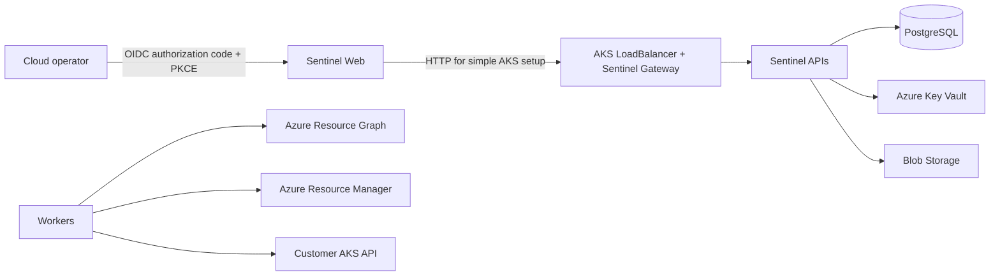
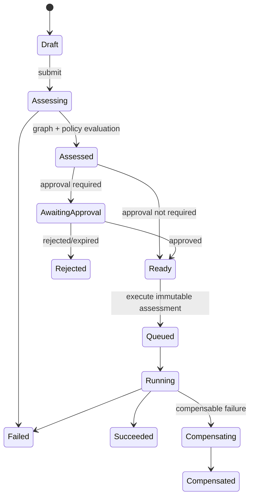

# Sentinel Architecture Overview

## Business Context

Sentinel is a multi-tenant Azure operations control plane. It answers four questions
before a change is made:

1. What Azure or Kubernetes object is being changed?
2. What depends on it?
3. What is the likely operational and governance impact?
4. Who or what is authorized to approve and execute the change?

Sentinel is not the source of truth for Azure resources. Azure Resource Manager (ARM),
Azure Resource Graph (ARG), the Kubernetes API, and Azure Activity Log remain
authoritative. Sentinel maintains a time-bounded inventory and a derived dependency
graph to support analysis.

## System Context

## Control-Plane Components

| Component | Responsibility |
|---|---|
| Next.js web | User experience, backend OAuth redirect, React Flow topology, API client |
| Identity service | Token validation, tenant membership, Sentinel RBAC |
| Inventory service | Subscriptions, discovery jobs, normalized Azure resource inventory |
| Relationship service | Dependency extraction, graph traversal, graph snapshots |
| Change Intelligence service | Deterministic impact and risk assessment |
| Operations service | Approval-gated execution and operation state machine |
| Audit service | Append-only user/system evidence, search, compliance export |
| PostgreSQL | Transactional service data in service-owned schemas |
| Azure Service Bus | Future durable commands/events and workload decoupling |
| Blob Storage | Future inventory payloads, reports, exports, and operation artifacts |
| Key Vault | Platform secrets/certificates that cannot use federated identity |
| Azure Monitor | Future logs, metrics, traces, alerts, dashboards |

## Multi-Tenant Identity Model

Sentinel uses a multi-tenant Microsoft Entra application registration for user login.
The application is registered in the Sentinel provider tenant. Customer admin consent
creates an enterprise application (service principal) in each customer tenant.

Two identities are distinct:

- **Human identity**: backend-owned authorization code + PKCE login resulting in an
  HTTP-only Sentinel session.
- **Customer automation identity**: customer-tenant service principal or customer
  managed identity authorized to discover or mutate selected Azure scopes.

The Phase 1 delegated model encrypts the user's rotating Microsoft refresh token inside
the Identity schema and uses it only to mint short-lived ARM access tokens for
Inventory. Other services and the browser never receive Microsoft tokens. A future
customer-side connector with managed identity remains preferred for unattended,
organization-owned execution.

Sentinel never assumes that a user who can sign in can operate every subscription.
Tenant onboarding, subscription registration, Sentinel RBAC, Azure RBAC, approval
policy, and operation allow-list must all permit the action.

Personal Microsoft accounts are supported. When Microsoft issues the shared consumer
tenant ID, Sentinel creates a user-isolated personal workspace. A personal user can
discover only Azure subscriptions available to that Microsoft identity.

## Request and Workload Flow

1. The current simple AKS gateway receives public traffic through a Kubernetes
   LoadBalancer and forwards to web/API services.
2. The API validates signature, issuer, audience, timestamps, and tenant claims.
3. Identity service resolves the external tenant and user to internal immutable IDs.
4. Authorization evaluates Sentinel role and resource scope.
5. The API sets database session tenant context and correlation identifiers.
6. Commands that can exceed an interactive timeout are persisted transactionally and
   published through an outbox. Service Bus transport is a later hardening step.
7. A worker claims the command, performs Azure work with the tenant automation
   identity, checkpoints progress, and emits versioned events.
8. Audit events are recorded for request, authorization, approval, execution, and
   result, with sensitive values redacted.

## Change Lifecycle

An assessment stores a canonical hash of action, target, parameters, inventory
snapshot, dependency graph version, rule-set version, and actor. Any change invalidates
approval and requires reassessment.

## Dependency Graph

PostgreSQL stores the canonical Phase 1 graph as normalized resources and directed,
typed relationships. Recursive CTEs support bounded impact traversal. Graph requests
must specify maximum depth and node count. Large results are returned as generated
snapshots, not unbounded interactive queries.

Relationship evidence includes discovery source, confidence, first/last observation,
and extractor version. Examples:

- `AKS --uses_identity--> ManagedIdentity`
- `ManagedIdentity --can_access--> KeyVault`
- `ApplicationGateway --routes_to--> BackendPool`
- `PrivateEndpoint --connects_to--> StorageAccount`

Neo4j/Cosmos DB Gremlin is deliberately deferred until measured PostgreSQL traversal
latency or graph scale justifies operational complexity.

## Reliability Targets

Initial service objectives after the simple deployment is hardened:

| Capability | Target |
|---|---|
| API availability | 99.9% monthly |
| Read API p95 | < 500 ms excluding generated graph snapshots |
| Command acceptance p95 | < 1 s |
| Inventory freshness | < 30 minutes for scheduled tenants |
| RPO | <= 5 minutes |
| RTO | <= 60 minutes |
| Audit durability | No acknowledged event loss |

The current one-node/simple AKS deployment is for demonstration and validation. It is
not expected to meet high availability objectives.

## Trust Boundaries

1. Public internet to AKS LoadBalancer/Sentinel gateway.
2. Provider Entra tenant to customer Entra tenants.
3. Sentinel control plane to customer Azure management plane.
4. AKS workload namespace to Azure platform services.
5. Service API boundary to each service-owned PostgreSQL schema.
6. Transactional audit store to future immutable compliance archive.

## Explicit Non-Goals for Phase 1

- AI-generated plans or autonomous execution
- Generic monitoring, cost analysis, or Azure portal replacement
- Arbitrary ARM API proxying
- Arbitrary shell, `kubectl`, or user-supplied script execution
- Cross-cloud inventory
- Active-active multi-region writes
